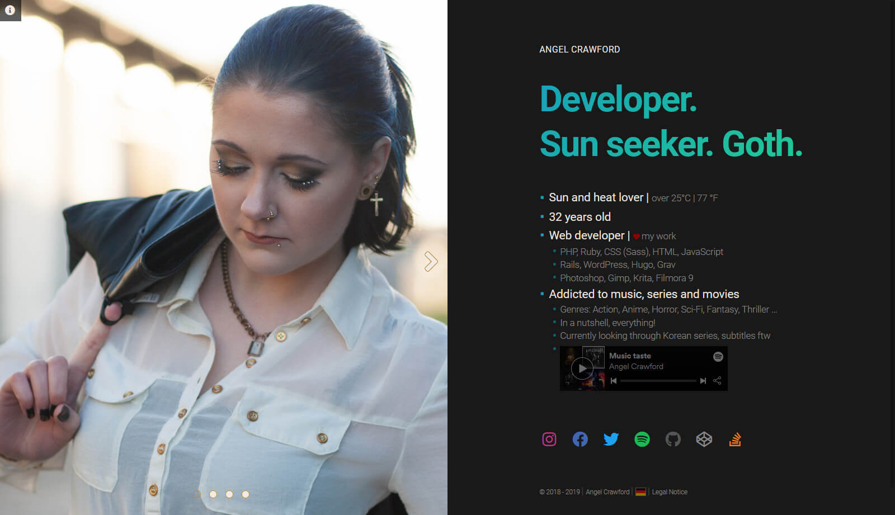

   

## Information
The whole Hugo Project for my personal Webcard (Short Profile).
Built with Hugo CMS and hosted on Github Pages.

* https://angel-crawford.de
* Languages: German / English
* Build with [Hugo](https://gohugo.io)

## Includes
* [Hugo](https://gohugo.io) => Extented Version
* Deploy file => [View Tutorial here](https://gist.github.com/AngelCrawford/06dbd50beee9f96064b8dc1d71dfa120)
* Original [Split](https://github.com/AngelCrawford/profilecard/tree/master/themes/hugo-split-theme) Theme (Buyed the Pro Version)
* [FontAwesome](https://fontawesome.com)

---

## Used Tutorials
### CSS, JS, jQuery
* [Tooltip](https://codepen.io/redouglas/pen/yyyXjm)
* [Slider](https://codepen.io/geekwen/pen/QNxymm)
* [Pie Chart](https://codepen.io/ejsado/pen/cLrlm)
* [Page Loader](https://github.com/aarmea/mfw-singlepage)

### Images
* [Licht- und Schattenspiel](https://www.facebook.com/lichtundschattenspiel)
* [Kara Kuckoo](https://www.facebook.com/KaraKuckoo)
* [Favicon Generator](https://realfavicongenerator.net)
* [The High Resolution Flag Sprite](https://www.freakflagsprite.com)
