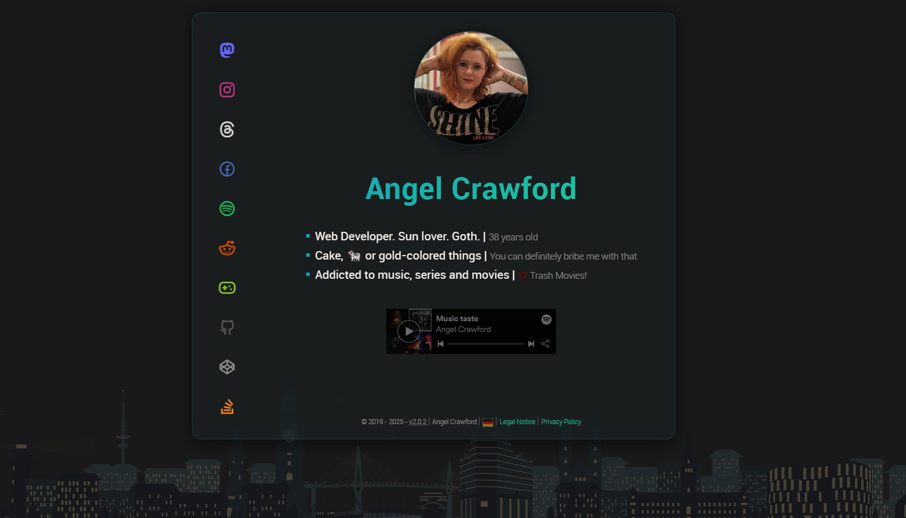

image:https://img.shields.io/badge/Platform-Windows-blue[] image:https://img.shields.io/badge/Editor-Atom-green[]

== Information
My personal Webcard (Short Profile).

Built with Hugo CMS and hosted on Github Pages.
This repository hosted the webpage from the public folder only, not the whole Hugo Project.

* https://angel-crawford.de
* Languages: Deutsch / English
* Build with https://gohugo.io[Hugo]

== Thanks
* Hugo @ https://gohugo.io
* Remix Icon @ https://remixicon.com
* Github Pages @ https://pages.github.com

=== CSS, JS, jQuery
* Tooltip @ https://codepen.io/redouglas/pen/yyyXjm
* PX-to-REM @ https://daniellamb.com/experiments/px-to-rem-calc
* Firework @ https://codepen.io/zystvan/details/LEbNRp
* Pumpkin @ https://codepen.io/krautgti/pen/ZEoMvrN?editors=1100
* Ghost @ https://codepen.io/uchardon/pen/eGjJap?editors=0100
* Santahat @ https://codepen.io/bennettfeely/pen/mEjio

=== Images
* Favicon Generator @ https://realfavicongenerator.net
* The High Resolution Flag Sprite @ https://www.freakflagsprite.com
